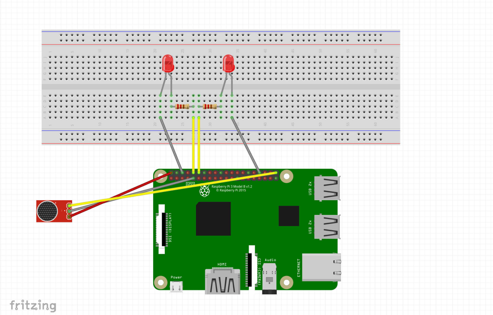

# Child-Sleeping-Care-Module

System Description
Raspberry Pi 3 Model B based edge device that detects sound and takes decisions to notify that sound detected
and forwards sound duration session to the Fog Layer.
The Device is connected to a sound sensor, and 2 LED used to notify existing a sound session.
This module overcomes the Connectivity challenge of IOT so can work and take the decision alone or with cooperation with other devices in the system.

## Getting Started

These instructions will get you a copy of the project up and running on your Rasbperry pi machine for development purposes.

### Prerequisites

```
Raspberry Pi 3 Model B
install Raspbian OS
putting this code on the pi
install this scheme
```



### Installing

```
sudo pip3 install paho-mqtt
```

### Run the code

```
python project.py
```
